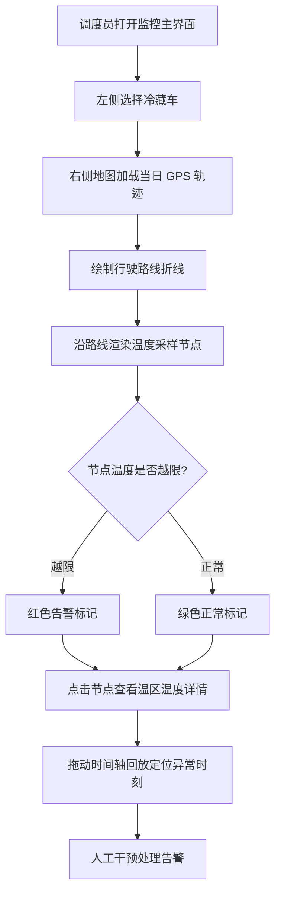

# 冷链物流多温区冷藏车追踪系统 PRD

## 1. 产品概述

面向冷链物流企业的在途监控平台,用于追踪多温区冷藏车的行驶轨迹与车厢内多个温区的实时温度,在温度越限时即时告警,降低货损风险。

- 主要使用者:冷链调度员、车队管理员、品控人员
- 核心价值:让"车在哪、货温是否安全"在同一张地图上可视化,把事后追责变成事中干预

## 2. 核心功能

### 2.1 用户角色

| 角色 | 说明 | 核心权限 |
|------|------|----------|
| 调度员 | 日常监控人员 | 查看车辆列表、轨迹、温度、处理告警 |
| 车队管理员 | 车辆资产管理者 | 维护车辆基础信息、温区配置、阈值配置 |

### 2.2 功能模块

1. **车辆列表页(主界面左侧)**:车辆卡片列表、在线状态、当前温区告警数、搜索过滤
2. **地图监控页(主界面右侧)**:行驶路线绘制、轨迹时间轴、温度随时间变化、温度过高告警标记

### 2.3 页面详情

| 页面名称 | 模块名称 | 功能描述 |
|----------|----------|----------|
| 监控主界面 | 车辆列表(左) | 展示所有冷藏车,含车牌、车型、当前状态;每辆车显示多温区温度概况与未处理告警数;支持按车牌/状态搜索过滤;点击选中后在地图聚焦该车 |
| 监控主界面 | 地图视图(右) | 以地图为底,绘制选中车辆当日行驶路线(折线);路线上按时间点标注节点;选中节点显示该时刻各温区温度;温度越限的节点以红色告警标记突出显示 |
| 监控主界面 | 温度详情面板 | 选中轨迹节点后,展示该时刻各温区(冷冻/冷藏/常温等)温度值与设定阈值,并以颜色区分正常/告警 |
| 监控主界面 | 时间轴控制 | 拖动时间轴回放轨迹,地图上车辆图标随之移动,温度面板同步刷新 |
| 车辆列表页 | 车辆基础信息卡 | 车牌号、车型、载重、所属温区数量及各温区名称与温度阈值 |

## 3. 核心流程

调度员打开监控主界面 → 左侧选择一辆车 → 右侧地图加载该车当日 GPS 轨迹并绘制路线 → 沿路线渲染温度采样节点(正常绿色 / 越限红色) → 点击节点查看该时刻各温区温度详情 → 发现红色告警后联动时间轴定位异常时刻,进行人工干预。

## 4. 界面设计

### 4.1 设计风格

- **风格定位**:冷链调度控制中心(mission control),工业感、深色仪表盘、信息密集但层次清晰
- **主色**:深石板灰/近黑底色(`#0b1220` 系),辅以"冷链蓝"高光(`#38bdf8` / `#22d3ee`)
- **告警色**:温度越限用琥珀橙(`#f59e0b`)与告警红(`#ef4444`);正常温度用青绿(`#22c55e`)
- **字体**:数据/坐标用等宽技术字体(JetBrains Mono 风格),标题与正文用清晰几何无衬线字体
- **布局**:左右分栏固定布局,左侧 320px 车辆列表可滚动,右侧地图全屏铺满;浮动半透明面板覆盖在地图上
- **按钮/卡片**:半透明玻璃拟态卡片、细描边、微弱内发光;hover 时边框高亮
- **图标**:使用 lucide-react 线性图标,与工业克制风格一致

### 4.2 页面设计概览

| 页面名称 | 模块名称 | UI 元素 |
|----------|----------|----------|
| 监控主界面 | 车辆列表(左) | 深色卡片堆叠,顶部搜索框;每张卡片含车牌(等宽字体)、状态圆点、温区温度小色条、告警徽章;选中卡片左侧亮蓝色高亮条 |
| 监控主界面 | 地图视图(右) | 全屏地图底图;路线为渐变折线;节点为圆点;越限节点为带脉冲动画的红色标记;当前车辆位置为车辆图标 |
| 监控主界面 | 温度详情面板 | 地图左上浮动玻璃卡片;列出每个温区:名称、当前温度、设定上下限、状态色块;温度用大号等宽数字 |
| 监控主界面 | 时间轴控制 | 地图底部浮动时间轴;可拖拽游标;左右播放控制按钮;游标位置显示对应时间 |

### 4.3 响应式

桌面优先(调度大屏场景),宽度 ≥1280px 为最佳;在窄屏下左侧列表可折叠为抽屉,地图始终占主视觉。
