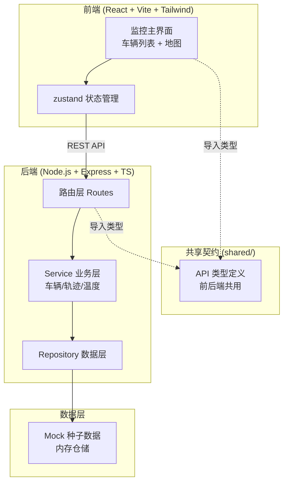
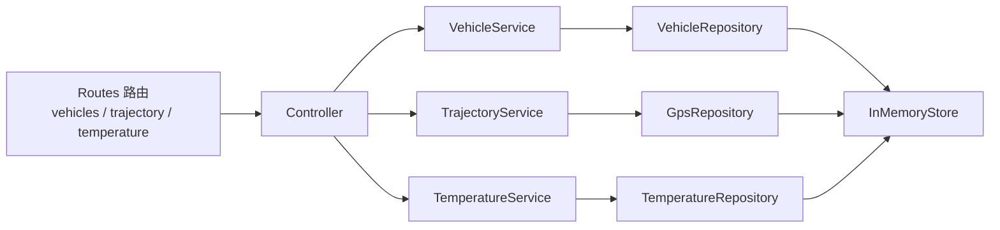
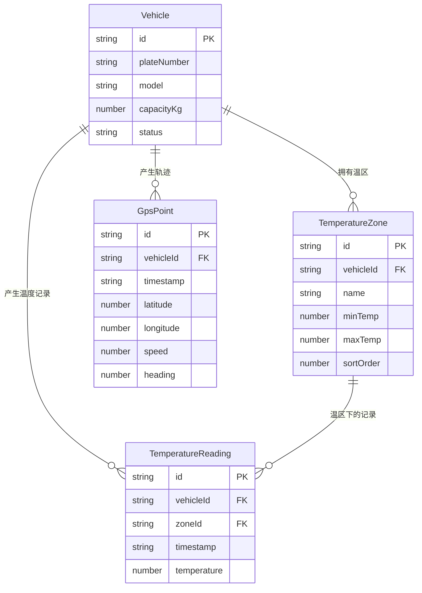

# 冷链物流多温区冷藏车追踪系统 - 技术架构文档

## 1. 架构设计



## 2. 技术说明

- 前端:React 18 + TypeScript + Vite + TailwindCSS + zustand(状态管理)+ react-leaflet / leaflet(地图,无需 API Key,使用 OpenStreetMap 瓦片)
- 初始化工具:vite-init(`react-express-ts` 模板,含 React + Express)
- 后端:Express + TypeScript,ESM 模块格式
- 数据层:内存仓储(Repository 模式),启动时由种子数据初始化;结构便于后续替换为 SQLite/Postgres
- 前后端接口契约:独立放在 `shared/` 目录,前后端共同导入,保证对齐

## 3. 路由定义

| 路由 | 用途 |
|------|------|
| `/` | 监控主界面:左侧车辆列表 + 右侧地图 |
| `/vehicles` | 车辆基础信息管理:列表与详情 |

## 4. API 定义

接口契约类型统一在 `shared/types.ts` 中定义(独立文件),前后端共同引用。以下为端点清单,请求/响应结构引用 shared 类型。

| 方法 | 路径 | 用途 | 请求参数 | 响应 |
|------|------|------|----------|------|
| GET | `/api/vehicles` | 车辆列表 | `?status=` 可选 | `VehicleSummary[]` |
| GET | `/api/vehicles/:id` | 车辆详情(含温区配置) | — | `VehicleDetail` |
| GET | `/api/vehicles/:id/trajectory` | GPS 轨迹 | `?date=YYYY-MM-DD` | `GpsPoint[]` |
| GET | `/api/vehicles/:id/temperatures` | 多温区温度记录 | `?date=YYYY-MM-DD` | `TemperatureReading[]` |
| GET | `/api/vehicles/:id/alerts` | 温度越限告警 | `?date=YYYY-MM-DD` | `TemperatureAlert[]` |

核心契约类型(shared/types.ts):

```typescript
// 车辆状态
export type VehicleStatus = 'online' | 'offline' | 'transporting';

// 温区配置
export interface TemperatureZone {
  id: string;
  vehicleId: string;
  name: string;          // 冷冻 / 冷藏 / 常温
  minTemp: number;      // 温度下限 ℃
  maxTemp: number;      // 温度上限 ℃
  sortOrder: number;
}

// 车辆基础信息
export interface VehicleSummary {
  id: string;
  plateNumber: string;
  model: string;
  capacityKg: number;
  status: VehicleStatus;
  zoneCount: number;
  activeAlertCount: number;
}

// 车辆详情(含温区配置)
export interface VehicleDetail extends VehicleSummary {
  zones: TemperatureZone[];
}

// GPS 轨迹点
export interface GpsPoint {
  id: string;
  vehicleId: string;
  timestamp: string;     // ISO 时间
  latitude: number;
  longitude: number;
  speed: number;         // km/h
  heading: number;       // 0-359
}

// 温度记录(某温区某时刻)
export interface TemperatureReading {
  id: string;
  vehicleId: string;
  zoneId: string;
  zoneName: string;
  timestamp: string;    // ISO 时间
  temperature: number;   // ℃
  minTemp: number;
  maxTemp: number;
  isAlert: boolean;     // temperature 超出 [minTemp, maxTemp]
}

// 温度越限告警事件
export interface TemperatureAlert {
  id: string;
  vehicleId: string;
  zoneId: string;
  zoneName: string;
  timestamp: string;
  temperature: number;
  minTemp: number;
  maxTemp: number;
  direction: 'high' | 'low';  // 过高 / 过低
  latitude: number;           // 关联轨迹点位置(用于地图标记)
  longitude: number;
}
```

## 5. 服务端架构图



三个业务模块(车辆基础信息 / GPS 轨迹 / 多温区温度)各自独立 Service + Repository,职责清晰。

## 6. 数据模型

### 6.1 数据模型定义



### 6.2 数据定义语言

内存仓储以 TypeScript 接口定义实体结构(等价 DDL),种子数据在 `api/seed/` 下按模块生成。`isAlert` 由 `temperature` 与温区 `minTemp/maxTemp` 计算得出(越限即告警)。

```sql
-- 等价关系模型(用于理解,实际存于内存仓储)
CREATE TABLE vehicle (
  id TEXT PRIMARY KEY,
  plateNumber TEXT NOT NULL,
  model TEXT NOT NULL,
  capacityKg REAL NOT NULL,
  status TEXT NOT NULL
);
CREATE TABLE temperature_zone (
  id TEXT PRIMARY KEY,
  vehicleId TEXT NOT NULL REFERENCES vehicle(id),
  name TEXT NOT NULL,
  minTemp REAL NOT NULL,
  maxTemp REAL NOT NULL,
  sortOrder INTEGER NOT NULL
);
CREATE TABLE gps_point (
  id TEXT PRIMARY KEY,
  vehicleId TEXT NOT NULL REFERENCES vehicle(id),
  timestamp TEXT NOT NULL,
  latitude REAL NOT NULL,
  longitude REAL NOT NULL,
  speed REAL NOT NULL,
  heading REAL NOT NULL
);
CREATE TABLE temperature_reading (
  id TEXT PRIMARY KEY,
  vehicleId TEXT NOT NULL REFERENCES vehicle(id),
  zoneId TEXT NOT NULL REFERENCES temperature_zone(id),
  timestamp TEXT NOT NULL,
  temperature REAL NOT NULL
);
```
